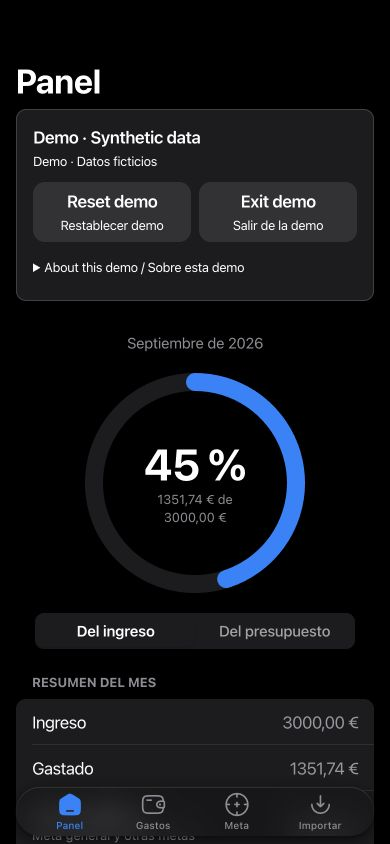

# MoneyMan

**Personal finance, kept local.** Understand where your money goes and how your
spending affects your savings goals, without connecting a bank account or sending
financial data to a server.

[Español](readmeESP.md) · [GitHub repository](https://github.com/J0rgw/myFinancesApp)

**Live demo:** _Not deployed yet. Add the public HTTPS URL here after deployment._



## What you can do

- Add income and expenses manually, or import a bank-format CSV with a preview and
  editable column mapping. Negative amounts become expenses; positive amounts
  become income. Imported expenses use the selected category (initially Importado).
- See this month's spending as a percentage of income or available spending budget.
- Explore spending by category with custom SVG charts.
- Set a general savings goal for 1, 3, 6 or 12 months, plus named goals with their
  own amount, savings already set aside and timeline.
- See an estimated savings trajectory based on recorded transactions.
- Use the mobile-first interface with light/dark system themes and desktop layouts.

The spending budget is calculated from income minus the monthly savings required
by your goals. This is a planning aid, not a bank balance or financial forecast.

## Try it without personal data

1. Open **Panel** (dashboard) and choose **Try demo / Probar demo**.
2. Explore **Gastos** (transactions), **Meta** (goals) and **Importar** (CSV import).
3. Add sample transactions or change a goal. The banner identifies the active demo.
4. Choose **Reset demo / Restablecer demo**, then confirm, to replace demo changes
   with the original sample. Cancel leaves the demo unchanged.
5. Choose **Exit demo / Salir de la demo** to discard the demo and return to your
   personal workspace.

The built-in dataset has 12 synthetic transactions, eight expense categories and
both general and named savings goals. Amounts and IDs are deterministic for a given
month. Dates cover the current calendar month, including days that may still be in
the future. Resetting starts a sample for the current month.

Personal records use the existing `localStorage` key, `moneyman-estado-v1`.
Demo records use a separate `sessionStorage` key, `moneyman-demo-v1`, so manual
entry, CSV import and goal editing in demo mode cannot overwrite personal records.
Reloading preserves the demo in the same tab when browser storage is available;
exiting removes it. Closing the tab normally ends the session, though browsers may
restore sessions. Only use synthetic files in the demo.

The existing interface remains Spanish. New demo controls have English and Spanish
copy; complete interface translation with i18n is deferred.

## Privacy and persistence

Transactions, settings and CSV contents are processed in your browser. There is no
backend, account, bank connection or analytics integration. Fonts are bundled locally.
The browser still downloads application assets from its host; that host may receive
ordinary request metadata. Financial records are not uploaded by the app.

Local storage is not encrypted, backed up or synchronized between devices. Clearing
site data removes saved records; private browsing and storage restrictions can limit
persistence. Anyone with access to this browser profile may be able to read its data.
The personal **Borrar todos mis datos** action in Meta requires confirmation and is
irreversible. It is hidden while the separate demo workspace is active.

## Run locally

Use Node **20.19+ within the 20.x line, or 22.12+** (the range in `package.json`).

```bash
npm install
npm run dev
```

Open the URL printed by Vite, normally `http://localhost:5173`.

```bash
npm run typecheck
npm run build
npm run preview
```

`build` checks TypeScript and creates `dist/`; `preview` serves that production
build locally. The project uses React 19, TypeScript, Vite, CSS Modules, Motion,
[Reicon](https://reicon.dev/icons), PapaParse and vite-plugin-pwa. Domain calculations,
feature screens and storage are kept in `src/domain`, `src/features` and `src/store`.
No new testing framework is included in Phase 1.

## CSV sample and first personal use

[`ejemplo-banco.csv`](ejemplo-banco.csv) is the existing sample fixture. To try the
importer safely, enter demo mode, select that file in **Importar**, review the
mapping (`Fecha`, `Concepto`, `Importe`) and confirm the nine movements. The CSV has
fixed July 2026 dates: its rows appear in **Gastos**, but they affect the dashboard
only when its current month is July 2026. Use the built-in demo for a current-month
dashboard. Reimporting a file adds its rows again; duplicate detection is not built in.

To use personal records, exit demo mode, set your monthly income, initial savings
and target in **Meta**, then add transactions in **Gastos** or import a CSV. Review
**Panel** for monthly percentages, categories and savings progress.

## PWA and hosting status

The project includes a manifest, service worker and offline app-shell caching.
Installation branding is **pending**: five referenced icon files are absent.
See [the PWA follow-up](docs/pwa-follow-up.md) for exact paths and the proposed fix.
A successful build does not prove that referenced icons exist or installation works.
Reicon supplies in-app interface icons; installation icons need separate image assets.

The existing `public/images/moneyman.jpg` is retained and used for social-preview
metadata. Its installation-icon derivatives and favicon wiring are deferred.
Serve `dist/` over HTTPS for a public installable PWA. A phone can reach a local
preview using `npm run preview -- --host`, but a plain LAN HTTP address generally
will not support installation/service workers. Physical-device installation and
offline behavior still need verification after the icon work.

Vite and manifest paths currently assume deployment at the origin root. Hosting
under a subdirectory, such as a GitHub project Pages URL, requires reviewing the
Vite base, font/icon URLs, manifest scope and start URL. Once hosting is chosen,
replace the live-demo placeholder and set canonical, `og:url` and an absolute
`og:image` URL. No deployment or GitHub push is part of this change.

## Screenshots and walkthrough

[Documentation screenshots](docs/screenshots/README.md) use only the generated demo.
For a quick walkthrough: load the demo, inspect income versus spending, switch to
budget percentage, review categories, change a savings goal, then reset and exit.

## Limitations and roadmap

- Spanish interface and EUR formatting; complete English/Spanish i18n is deferred.
- Local-only persistence, no cloud sync, export/backup or automatic bank connection.
- No duplicate detection, recurring payments or editable category-budget feature.
- Dashboard shows the current month; transaction history remains in Gastos.
- Savings projections depend on the entered data; partial months can skew estimates.
- PWA installation assets and a public HTTPS deployment remain pending.
- No automated test suite or CI yet; a full accessibility and performance audit is pending.

Next: finish PWA branding; then Phase 2 adds calculation/CSV tests, React component
coverage, a browser happy path, accessibility checks, CI and a Lighthouse/bundle
review. Later phases can add budgets, recurring movements, duplicate detection,
monthly comparisons and export/backup. Full i18n should be a separately scoped task.
